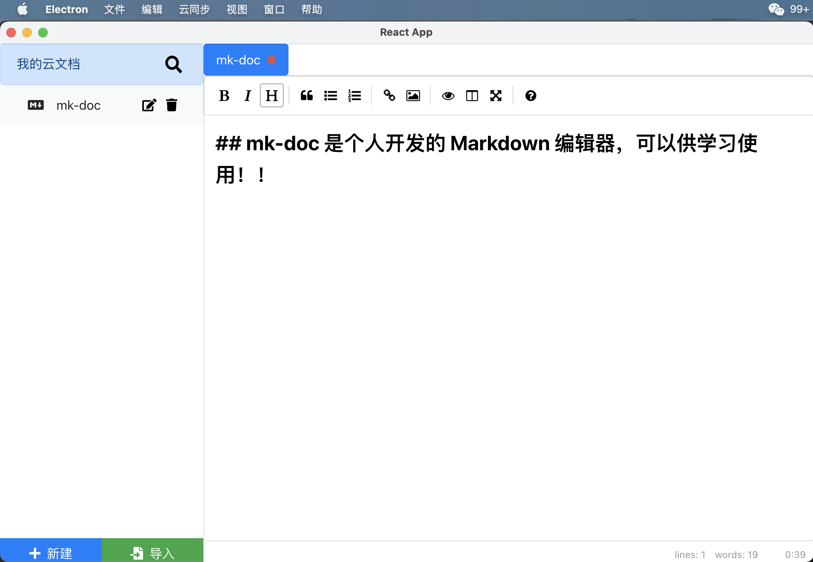
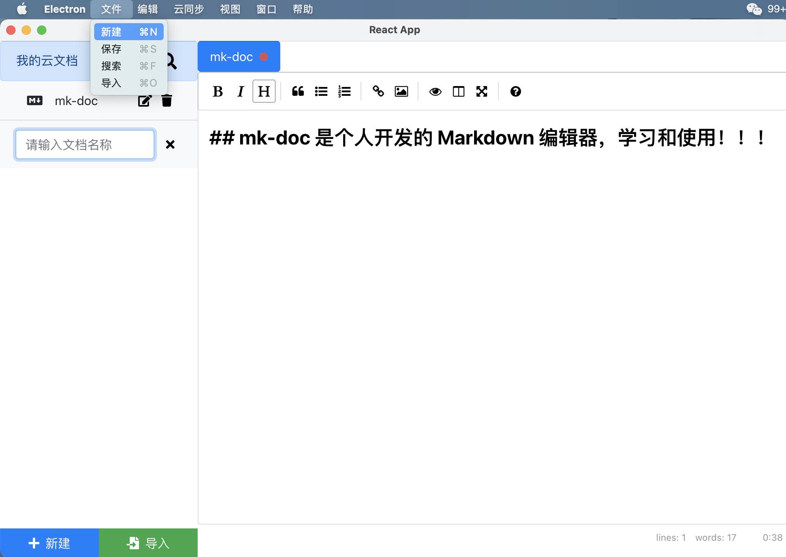
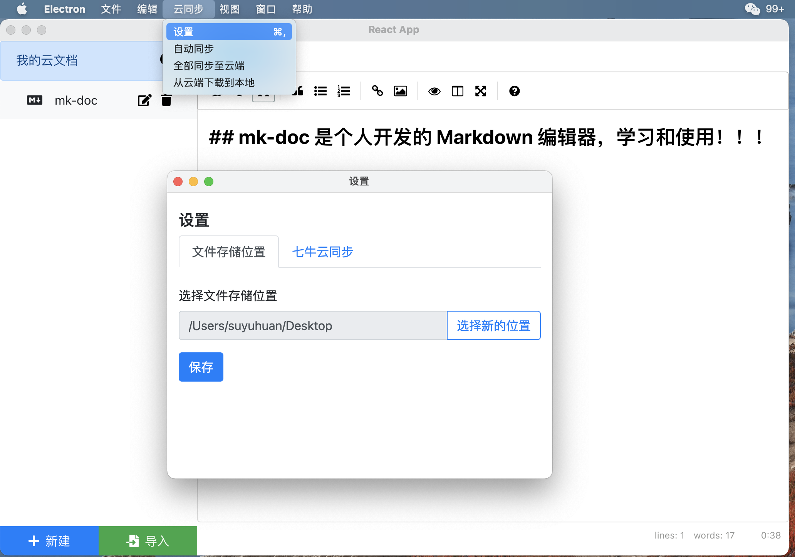

## 云文档

是一个兼容 mac 和 windows 的开源,用七牛云存储的 Markdown 编辑器 app 程序，可以用于个人日常使用。

#### 安装运行

```
npm clone https://github.com/suyuhuan/mk-doc.git
cd mk-doc
npm install
npm run dev
```

#### 功能实现

- 1.文件的新建
- 2.文件的保存
- 3.文件的修改
- 4.文件的导入
- 5.文件的搜索
- 7.七牛云设置
- 6.云自动同步
- 7.全部同步到云
- 8.从云下载到本地

#### 使用技术栈

- electron: 桌面应用框架
- node: 后端服务
- react: view 渲染
- prop-types:类型检查
- bootstrap: css 样式库

#### elctorn && react 配置说明

- concurrently 同时运行多个命令
- wait-on 执行等待
- cross-env 通过 js 在平台设置不同的环境变量的工具
- 支持跨平台

```
//package.json
"scripts": {
 "dev": "concurrently \"wait-on http://localhost:3000 && electron .\" \"cross-env BROWSER=none npm start\""
}
```

#### src 目录结构说明

- components: 展示型组件
- containers: 容器型组件
- hooks: 自定义 hook
- utils: 工具库
- **test**: 测试文件

### 组件说明

- 展示型组件:
- 容器型组件:

## 项目效果展示




